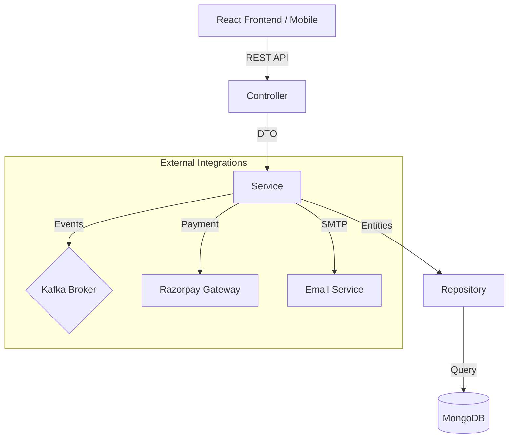

# 🚀 ZAPfest - Food Delivery Backend (Spring Boot + MongoDB)

> **Live Demo:** [https://zapfest-production.up.railway.app/swagger-ui.html](https://zapfest-production.up.railway.app/swagger-ui.html)  
> **Backend Status:** ✅ Production Ready  
> **Deployment:** Railway (Dockerized)

A production-grade, event-driven food delivery backend system built to meet comprehensive enterprise requirements.

---

## 🏗️ Architecture & Tech Stack

This project follows a **Layered Architecture** with strict separation of concerns.



| Component | Technology | Version | Usage |
|-----------|------------|---------|-------|
| **Framework** | Spring Boot | 4.0.2 | Core backend framework |
| **Language** | Java | 21 | Modern Java features |
| **Database** | MongoDB | 7.x | High-performance NoSQL store |
| **Security** | Spring Security + JJWT | 0.13.0 | RBAC & Stateless Auth |
| **Documentation** | SpringDoc OpenAPI | 3.0.1 | Auto-generated Swagger UI |
| **Rate Limiting** | Bucket4j | 8.16.0 | API protection |
| **Caching** | Caffeine | 3.x | High-performance local cache |
| **Events** | Apache Kafka | 3.6 | Event-driven updates |
| **Cloud** | Railway | - | CI/CD & Hosting |

---

## ✨ Features Implemented (vs Requirements)

| Feature Category | Status | Details |
|------------------|:------:|---------|
| **User Mgmt** | ✅ | Register, Login, JWT, RBAC (Admin/Owner/Customer/Delivery) |
| **Core Domain** | ✅ | CRUD for Restaurants, Menu Items, Orders, Addresses |
| **Search/Filter** | ✅ | MongoTemplate complex queries for cuisines/names |
| **Security** | ✅ | BCrypt, Stateless JWT, Role guards (`@PreAuthorize`) |
| **Payments** | ✅ | Razorpay integration (Mock/Test mode enabled) |
| **Analytics** | ✅ | Admin dashboard stats (Revenue, Orders, Top Restaurants) |
| **Notifications** | ✅ | Email service + Kafka event publishing |
| **Reliability** | ✅ | Global Exception Handling, Input Validation, Rate Limiting |
| **DevOps** | ✅ | Docker Compose, Railway config, Environment variables |

---

## 🚀 Quick Start

### 1. Cloud Deployment (Railway)
The easiest way to run the backend.

1. **Fork/Push** this repo to GitHub.
2. Create a project in **Railway**.
3. Add **MongoDB** service.
4. Set Environment Variables:
   - `MONGO_URL`: `${{MongoDB.MONGO_URL}}/zapfest?authSource=admin`
   - `JWT_SECRET`: (Any secure 32+ char string)
5. **Deploy!**

### 2. Local Docker (Recommended)
```bash
# Starts App, MongoDB, Kafka, Zookeeper
docker-compose up --build
```
Access at `http://localhost:8080/swagger-ui.html`

### 3. Manual Run
Requires Java 21+ and local MongoDB running on port 27017.
```bash
mvn spring-boot:run
```

---

## 🧪 Test Credentials (Seeded Data)

The database is pre-seeded with these accounts:

| Role | Email | Password |
|------|-------|----------|
| **Admin** | `admin@zapfest.com` | `admin123` |
| **Customer** | `customer@test.com` | `password123` |
| **Owner** | `owner1@test.com` | `password123` |
| **Delivery**| `delivery@test.com` | `password123` |

---

## 📂 Project Structure

```text
src/main/java/com/fooddelivery
├── config/          # Security, Swagger, Cache configs
├── controller/      # REST API endpoints (Web Layer)
├── dto/             # Data Transfer Objects (Request/Response)
├── exception/       # Global Exception Handling
├── model/           # MongoDB Entities
├── repository/      # Spring Data Repositories
├── security/        # JWT Filter, UserDetails service
├── service/         # Business Logic
└── util/            # Helper classes
```

---

## 📝 API Overview

Full documentation available in Swagger UI. Key endpoints:

- **Auth**: `/api/auth/login`, `/api/auth/register`
- **Restaurants**: `/api/restaurants` (Public), `/api/restaurants/{id}/menu`
- **Orders**: `/api/orders` (Create, Track, Cancel)
- **Admin**: `/api/analytics/dashboard` (Protected)

---

## ✅ Bonus Achievements
- **Event-Driven**: Kafka integration for order events.
- **Dockerized**: Full `docker-compose` setup included.
- **CI/CD**: Ready for Railway/Render automatic deployments.
- **Data Seeder**: Auto-populates mock data on startup.
